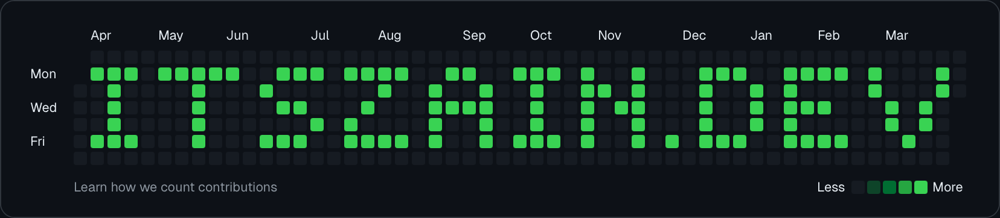

  

  ### 🚀 Full-Stack Developer | Mobile & Web Specialist
  
  
  
  
  

---

### 💫 About Me
I am a passionate Full-Stack Developer specializing in building high-performance mobile and web applications. I measure success in milliseconds shaved off load time.

- 🔭 **Current Projects:** Working on full-stack apps with **Next.js, Flutter & Docker**.
- 🌱 **Growth:** Learning system design & scalable architectures.
- 💬 **Topics:** Ask me about web, mobile, and cloud deployments.
- ⚡ **Motto:** Performance is not a feature; it's a requirement.

---

### 💻 Tech Stack

#### 🌐 Languages
     

#### 🚀 Frameworks & Libraries
       

#### 🗄️ Databases & Backend-as-a-Service
     

#### ☁️ Cloud & DevOps
     

